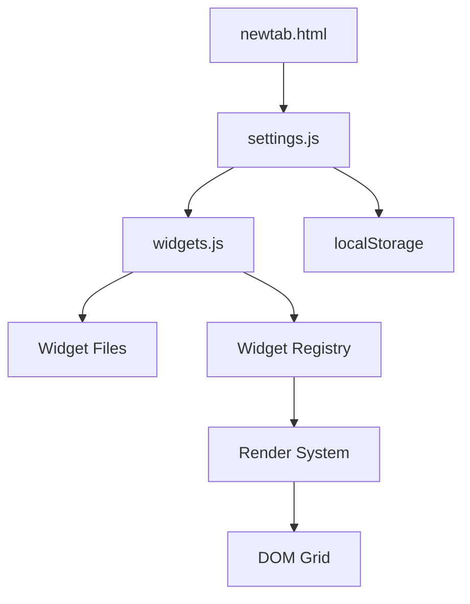

# NewTab PlusProMaxUltra Documentation

Welcome to the comprehensive documentation for the NewTab PlusProMaxUltra Chrome extension. This documentation provides everything you need to understand, contribute to, and extend the project.

## 📚 Documentation Overview

### For Developers

#### 🎨 **[Styling Guide](STYLING_GUIDE.md)**
Complete design system documentation covering:
- Glassmorphism color palette and effects
- Typography and font systems  
- Animation timing and transitions
- Responsive design patterns
- CSS naming conventions and architecture

#### 🧩 **[Widget Development](WIDGET_DEVELOPMENT.md)**
Step-by-step guide for creating new widgets:
- Widget architecture and file structure
- Required functions and lifecycle management
- Configuration interface patterns
- Event handling and state management
- Integration with core systems

#### 🏗️ **[Component Rules](COMPONENT_RULES.md)**
Architectural standards and patterns:
- File organization and loading order
- Global state management principles
- DOM manipulation standards
- Naming conventions across JS/CSS/HTML
- Performance and security considerations

#### 🎯 **[UI Behavior](UI_BEHAVIOR.md)**
User experience and interaction standards:
- Grid system behavior (default and jiggle modes)
- Panel and modal interaction patterns
- Animation system and timing
- Keyboard navigation and accessibility
- Responsive behavior standards

#### ⭐ **[Features Documentation](features/README.md)**
Comprehensive widget and feature documentation:
- Current widgets (Clock, Calculator, Search, Date)
- Planned features with detailed specifications
- Feature development workflow and standards
- Status tracking (Completed, In Progress, Planned, Ideas)
- Standardized documentation templates

### For Contributors

#### 🚀 **[Getting Started](#getting-started)**
Quick setup guide for development

#### 🔧 **[Development Workflow](#development-workflow)**  
Standard practices for contributing

#### 📋 **[Architecture Overview](#architecture-overview)**
High-level system design

---

## 🚀 Getting Started

### Prerequisites
- Google Chrome browser
- Text editor or IDE
- Basic knowledge of HTML, CSS, and JavaScript

### Development Setup

1. **Clone the repository**
   ```bash
   git clone [repository-url]
   cd newtab-pluspromaxultra
   ```

2. **Load extension for testing**
   - Open Chrome and navigate to `chrome://extensions`
   - Enable "Developer mode"
   - Click "Load unpacked" and select the `extension/` folder
   - Open new tab to see the extension in action

3. **Make changes and reload**
   - Edit files in the `extension/` directory
   - Click the refresh icon on the extension in `chrome://extensions`
   - Open new tab to see changes

### Essential Files
- **`extension/newtab.html`** - Main HTML structure
- **`extension/settings.js`** - Global settings and persistence
- **`extension/widgets.js`** - Core widget system
- **`extension/styles.css`** - Complete styling system
- **`extension/widgets/`** - Individual widget implementations

---

## 🔧 Development Workflow

### File Loading Order
Critical dependency chain that must be maintained:

```html
<!-- newtab.html -->
<script src="settings.js"></script>      <!-- Global settings -->
<script src="widgets.js"></script>       <!-- Core widget system -->
<script src="widgets/clock-widget.js"></script>     <!-- Widget types -->
<script src="widgets/calculator-widget.js"></script>
<!-- Additional widgets... -->
```

### Widget Development Process

1. **Create widget file**: `extension/widgets/my-widget.js`
2. **Add script tag** to `newtab.html` 
3. **Follow widget template** from [Widget Development Guide](WIDGET_DEVELOPMENT.md)
4. **Test in browser** and iterate
5. **Add widget-specific styling** to `styles.css`

### Contributing Guidelines

- **Follow established patterns** - Study existing widgets before creating new ones
- **Use provided helpers** - Leverage `createWidgetContainer()`, `setupWidgetConfigButtons()`, etc.
- **Maintain consistency** - Follow naming conventions and architectural rules
- **Test thoroughly** - Verify widget works in all modes and screen sizes
- **Document changes** - Update relevant documentation files

---

## 📋 Architecture Overview

### System Architecture



### Core Components

#### Settings System (`settings.js`)
- **Purpose**: Global configuration management and persistence
- **Key Functions**: `loadSettings()`, `saveSettings()`, `saveAndRender()`
- **Storage**: localStorage with JSON serialization
- **Structure**: Background, global appearance, and widget configurations

#### Widget System (`widgets.js`)
- **Purpose**: Widget lifecycle management and grid interactions
- **Key Features**: Registration, rendering, drag/drop, resize, jiggle mode
- **Registry Pattern**: Central registry for all widget types
- **Event System**: Unified event handling for grid interactions

#### Individual Widgets (`widgets/*.js`)
- **Purpose**: Self-contained widget implementations
- **Pattern**: Registration → Configuration → Rendering → Logic Setup
- **Integration**: Uses core system helpers for consistency
- **Isolation**: Each widget in separate file with IIFE wrapper

### Data Flow

1. **Initialization**: Settings loaded from localStorage
2. **Registration**: Widget types register with central system
3. **Rendering**: Widgets rendered based on saved configuration
4. **Interaction**: User changes trigger settings updates
5. **Persistence**: Changes automatically saved to localStorage
6. **Re-render**: UI updated to reflect new settings

### State Management

- **Single Source of Truth**: Global `settings` object
- **Unidirectional Flow**: User action → Settings update → Re-render
- **Persistence**: Automatic localStorage synchronization
- **Validation**: Input validation and default value handling

---

## 🎯 Key Concepts

### Widget Architecture
- **Modular Design**: Each widget type is self-contained
- **Registry Pattern**: Central registration system for discoverability
- **Configuration-Driven**: All behavior controlled by settings objects
- **Responsive**: Container queries enable adaptive layouts

### Grid System
- **Fixed Layout**: 40×24 grid system for consistent positioning
- **Flexible Widgets**: Widgets can span multiple grid cells
- **Visual Feedback**: Grid overlay in jiggle (edit) mode
- **Snap-to-Grid**: Automatic alignment during drag operations

### Appearance System
- **Global Defaults**: Shared appearance settings across all widgets
- **Widget Overrides**: Individual widgets can customize appearance
- **Responsive Scaling**: Text and spacing adapt to widget size
- **Theme Consistency**: Unified glassmorphism design language

### Interaction Modes
- **Default Mode**: Normal navigation and widget interaction
- **Jiggle Mode**: Edit mode with drag, resize, and configuration
- **Configuration Mode**: Modal panels for detailed widget setup
- **Settings Mode**: Global extension configuration

---

## 🛠️ Extension Points

### Adding New Widget Types
1. Create `extension/widgets/my-widget.js`
2. Follow the [Widget Development Guide](WIDGET_DEVELOPMENT.md)
3. Add corresponding CSS styles if needed
4. Test across different sizes and configurations

### Extending Appearance System  
1. Add new properties to `globalWidgetAppearance` in settings
2. Update `applyWidgetAppearance()` function to handle new properties
3. Add UI controls to appearance configuration panel
4. Test with existing widgets to ensure compatibility

### Adding New Interaction Patterns
1. Study existing patterns in [UI Behavior Guide](UI_BEHAVIOR.md)
2. Implement following established animation and timing standards
3. Ensure keyboard and accessibility support
4. Update documentation with new patterns

---

## 🔍 Debugging and Troubleshooting

### Common Issues

**Widget doesn't appear in list**
- Check if widget file is loaded in `newtab.html`
- Verify `registerWidget()` call syntax
- Look for JavaScript errors in browser console

**Configuration doesn't save**
- Ensure form element IDs match JavaScript selectors
- Check that `saveAndRender()` is called after changes
- Verify settings object structure matches expected format

**Styling issues**
- Follow CSS naming conventions from [Styling Guide](STYLING_GUIDE.md)
- Use container queries for responsive widget content
- Check specificity conflicts with existing styles

**Performance issues**
- Clean up intervals using `activeIntervals` array
- Use efficient DOM queries and avoid layout thrashing
- Follow animation best practices from [UI Behavior Guide](UI_BEHAVIOR.md)

### Development Tools
- **Chrome DevTools**: Essential for debugging JavaScript and CSS
- **Extension Panel**: Monitor extension loading and errors
- **Console Logging**: Add strategic logging for state changes
- **Performance Tab**: Profile animation and interaction performance

---

## 📖 Additional Resources

### Related Files
- **`CLAUDE.md`** - Project instructions for AI development assistance
- **`README.md`** - Main project documentation and setup
- **`package.json`** - Project metadata and development dependencies
- **`extension/manifest.json`** - Chrome extension configuration

### External References
- [Chrome Extension Documentation](https://developer.chrome.com/docs/extensions/)
- [CSS Container Queries](https://developer.mozilla.org/en-US/docs/Web/CSS/CSS_Container_Queries)
- [Web Accessibility Guidelines](https://www.w3.org/WAI/WCAG21/quickref/)
- [JavaScript Best Practices](https://developer.mozilla.org/en-US/docs/Web/JavaScript/Guide)

---

## 🤝 Contributing

We welcome contributions! Please:

1. **Read the documentation** - Understand the architecture and patterns
2. **Follow the guides** - Use established development workflows  
3. **Test thoroughly** - Ensure changes work across different scenarios
4. **Update docs** - Keep documentation current with code changes
5. **Ask questions** - Use GitHub issues for clarification

### Documentation Updates

This documentation should be updated whenever:
- New architectural patterns are established
- Widget development process changes
- UI/UX standards evolve  
- New best practices are identified

Keep documentation current and comprehensive to ensure smooth development experience for all contributors.

---

*This documentation is part of the NewTab PlusProMaxUltra project. For the latest updates and additional resources, visit the project repository.*